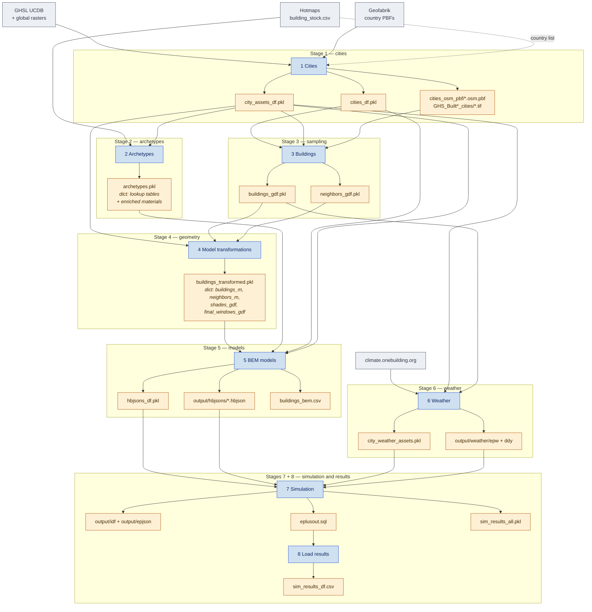

# BEM4AI

This repository contains the code used to construct and simulate the BEM4AI
building-energy models. The accompanying HBJSON models, EnergyPlus results,
and tabular artifacts are distributed separately through the dataset
repository.

## Contents

- `notebooks/`: the primary workflow, from source data and building-stock
  preparation through model construction, weather assignment, simulation, and
  result extraction.
- `notebooks/helpers/`: functions imported by the notebooks. `utils.py` holds
  the shared helpers; the remaining modules cover local metric frames,
  shading and window selection, zone quality and connectivity, review-app
  launching, and application of review selections.
- `config/`: stable source mappings and BEM assumptions. See `config/README.md`
  for the geography, building-type, Honeybee-material, and model-assignment
  configuration files.
- `scripts/`: executable utilities, local review frontends, and the documented
  ConvexDecomp and Honeybee-preview components used by the notebooks.
- `LICENSE`: the CC BY 4.0 licence covering the original repository content.

## Convex decomposition

`scripts/ConvexDecomp/` is derived from **ConvexDecomp**, which accompanies
*Workflow-Oriented Convex Decomposition of 2D Building Geometry* (Dalach, Chen
and Borrmann, 33rd International Workshop on Intelligent Computing in
Engineering, 2026, <https://mediatum.ub.tum.de/node?id=1855368>). The complete
project, examples, and citation metadata are available in the
[ConvexDecomp repository](https://github.com/adalach/ConvexDecomp).

It is a reduced and extended copy rather than a snapshot: the ResPlan floorplan
adapters and the paper's figure code are not here, the library's own duplicates
of geometry helpers are replaced by imports from `notebooks/helpers/utils.py`,
and two things this pipeline needs were added - alignment of a neighbour's
edges to a reference building, and a runner that labels every zone with the
part of the building it came from, so that perimeter and core zones can be told
apart downstream. See `scripts/ConvexDecomp/README.md` for the module map.

## Honeybee model plotting

The Stage 5 static and interactive model previews use the renderers bundled in
`scripts/jupyter-honeybee-plot/`. They come from the
[jupyter-honeybee-plot repository](https://github.com/adalach/jupyter-honeybee-plot),
where additional plotting settings and examples are available. The bundled
copy keeps the publication workflow runnable without installing that project
separately.

## Pipeline overview

Each notebook reads files written by an earlier notebook and writes its own
into `data/interim/`. Nothing is passed between notebooks in memory, so any
stage can be re-run on its own as long as the files it reads already exist.
The diagram shows only the artifacts that cross a notebook boundary; caches,
audit tables, and intermediate CSV dumps are listed in the tables below.



## Stage reference

| Notebook | Reads | Writes |
|---|---|---|
| `BEM4AI_1_Cities` | GHSL UCDB workbook and GeoPackage, GHSL global rasters, per-country Geofabrik PBFs, `building_stock.csv` (country list only), `config/indicator_attribute_mapping.csv`, `config/geography.json` | `cities_df.pkl`, `city_assets_df.pkl`, per-city OSM extracts and GHSL chips |
| `BEM4AI_2_Archetypes` | `building_stock.csv`, `city_assets_df.pkl`, `config/geography.json`, `config/building_types.json`, `config/hb_material_rules.json` | `archetypes.pkl` |
| `BEM4AI_3_Buildings` | `cities_df.pkl`, `city_assets_df.pkl`, per-city OSM extracts and GHSL chips, `config/building_types.json` | `buildings_gdf.pkl`, `neighbors_gdf.pkl`, `sample_id_map_buildings.csv`, footprint-review record |
| `BEM4AI_4_ModelTransformations` | `buildings_gdf.pkl`, `neighbors_gdf.pkl`, `city_assets_df.pkl` | `buildings_transformed.pkl`, `selected_bad_building_samples.csv` |
| `BEM4AI_5_BEMModels` | `buildings_transformed.pkl`, `archetypes.pkl`, `cities_df.pkl`, `config/hb_mappings.json` | `output/hbjsons/`, model indexes, `buildings_bem.csv`, interactive preview, optional BEM-review artifacts |
| `BEM4AI_6_Weather` | `city_assets_df.pkl`, `buildings_gdf.pkl` | `city_weather_assets.pkl`, `weather_download_links.csv`, `output/weather/` |
| `BEM4AI_7_Simulation` | `hbjsons_df.pkl`, `city_weather_assets.pkl`, `output/hbjsons/`, `output/weather/` | `output/idf/`, `output/epjson/`, `output/simulations/`, `sim_results_all.pkl` |
| `BEM4AI_8_LoadResults` | EnergyPlus `.sql` files from `output/simulations/` | `sim_results_df.csv`, `bad_sql_files.csv` |


### Restartable simulations

Stage 7 counts a model as complete only when its run log records a successful simulation and the
corresponding `<sample_id>.sql` file exists. Failed and incomplete runs remain pending. The
notebook checkpoints final statuses every ten models and uses the same explicit EnergyPlus output
contract as the IDF/EPJSON conversion utility, including the rate variables required by the graph
datasets.


## Interim artifacts

Everything below lives in `data/interim/`. The first block is the stage-to-stage
handoff plus the pipeline's final tables; a dash in *Read by* marks an end
product rather than an input to a later stage. The second block is produced for
inspection and is not read back by any notebook.

| File | Written by | Read by | Contents |
|---|---|---|---|
| `cities_df.pkl` | 1 | 3, 5 | One row per city: the GHSL UCDB indicators, filtered to the study area and to countries that have building-stock data. |
| `city_assets_df.pkl` | 1 | 2, 3, 4, 6 | One row per city: `city_key`, centroid, and the filenames of that city's OSM extract and GHSL chips. |
| `archetypes.pkl` | 2 | 5 | Dict payload containing `countries`, `building_types`, `age_classes`, `elements`, `cities`, and `materials`. The material rows include source composition and U-values plus generated Honeybee material and construction JSON. |
| `buildings_gdf.pkl` | 3 | 4, 6 | The sampled building footprints, one row per `sample_id`. |
| `neighbors_gdf.pkl` | 3 | 4 | Surrounding footprints for each sampled building, keyed by the same `sample_id`. |
| `buildings_transformed.pkl` | 4 | 5 | Dict payload. Stage 5 reads four keys by name: `buildings_m` (one row per sample, carrying the zone decomposition), `neighbors_m`, `shades_gdf`, and `final_windows_gdf`. |
| `hbjsons_df.pkl` | 5 | 7 | Compact index with one row per validated model, including its `sample_id`, `city_key`, and HBJSON filename. |
| `hbjsons_df_full.pkl` | 5 | — | Full per-model attribute table backing the validated HBJSON files. |
| `buildings_bem.csv` | 5 | — | CSV export of the full validated model table. |
| `city_weather_assets.pkl` | 6 | 7 | `city_assets_df` restricted to the cities that have sampled buildings, with the selected station and EPW/DDY filenames and repository-relative paths attached. Stage 7 joins it by `city_key` and uses `epw_relpath` and `ddy_relpath`. |
| `sim_results_all.pkl` | 7 | — | Per-simulation run status and paths, kept as the record of what was simulated. |
| `sim_results_df.csv` | 8 | — | Parsed EnergyPlus metrics, one row per model, keyed on `sample_id`. |

| Inspection output | Written by | Purpose |
|---|---|---|
| `extracted_attributes.csv`, `extracted_attributes_filtered_*.csv` | 1 | The GHSL attribute table before and after the geographic filter. |
| `pbf_building_status.csv` | 1 | Cache recording which per-city OSM extracts contain buildings. Delete it to force a full re-check. |
| `sample_id_map_buildings.csv` | 3 | Maps each final `sample_id` to the OSM `building_id` it came from. |
| `selected_bad_footprint_samples.csv` | 3 | `sample_id` values rejected in the sampled-footprint review. |
| `selected_bad_building_samples.csv` | 4 | `sample_id` values rejected in the transformed-building review. |
| `selected_bad_bem_models.csv` | 5 | `sample_id` values rejected in the generated-BEM review. |
| `weather_download_links.csv` | 6 | Download URL per city, for fetching EPW and DDY files outside the notebook. |
| `hbjson_to_idf_epjson.csv` | 7 | Per-model HBJSON-to-IDF/EPJSON conversion status. |

### One model export

Stage 5 writes one HBJSON directory and one set of model tables. The
`ADD_NEIGHBOR_SHADES` setting in the neighboring-shade cell determines whether
the exported models contain contextual shades without changing their output
location. The default is `True`, matching the published BEM4AI models.

## Naming conventions

`city_key` is the stable city identifier used across every stage. It is derived
once in Stage 1 from the GHSL city name by stripping accents, transliterating
special letters, and replacing runs of non-alphanumeric characters with a single
underscore, so `Bolzano - Bozen` becomes `Bolzano_Bozen`. Every per-city file is
named after it, and it is the join key between the city tables, the OSM
extracts, the GHSL chips, and the weather assets. `country_key` is built the same
way from the GHSL country name and is used for the per-country OSM downloads.

`sample_id` is the stable per-building identifier, assigned in Stage 3 as
`{city_key}_{sequence}` and carried unchanged through the transformation,
model export, simulation, and result stages. The mapping back to the original
OSM `building_id` is kept in `sample_id_map_buildings.csv`.

Two city tables exist on purpose and are not interchangeable. `cities_df.pkl`
holds the GHSL indicators for a city, so it answers questions about the city
itself: population, area, built-up shares. `city_assets_df.pkl` holds one row
per city with the filenames of the artifacts generated for it, so it answers
where that city's OSM extract and raster chips are on disk. Stages that need
both read both. A third, narrower table appears in Stage 6:
`city_weather_assets.pkl` is `city_assets_df` reduced to the cities that
actually have sampled buildings, with the weather filenames added; it does not
replace the Stage 1 table.

Stage 2 also produces a `cities` table inside `archetypes.pkl`. That one is
a dimension table with an integer `id` and a `country_id` foreign key, used only
to join building-stock records; it is not a substitute for `city_assets_df.pkl`.

### Single frames and dict payloads

Most interim files hold one DataFrame and can be used directly:

```python
buildings_gdf = pd.read_pickle(INTERIM_DIR / "buildings_gdf.pkl")
```

Two of them hold a dictionary of named frames instead, and must be unpacked:

```python
payload = pd.read_pickle(INTERIM_DIR / "buildings_transformed.pkl")
buildings_m = payload["buildings_m"]          # also: neighbors_m, shades_gdf, final_windows_gdf

archetypes = pd.read_pickle(INTERIM_DIR / "archetypes.pkl")
materials = archetypes["materials"]           # also: countries, building_types,
                                              #       age_classes, elements, cities
```

This is why Stage 5 prints `buildings_m`, `neighbors_m`, `shades_gdf`, and
`final_windows_gdf` when it starts: those are the keys it unpacked from the
single `buildings_transformed.pkl` file, not four separate files on disk.

### Where the Honeybee constructions are built

The envelope constructions are produced once in the Archetypes notebook and
only assembled in Stage 5. Stage 2 does the thermal work: for each country,
building type, age class, and element it solves for the insulation resistance
that reaches the building-stock target U-value, and writes the generated
material and construction as JSON into the `materials` table in
`archetypes.pkl`. Stage 5 deserializes that JSON
into live Honeybee objects with `EnergyMaterialNoMass.from_dict` and
`EnergyWindowMaterialSimpleGlazSys.from_dict`, and assembles them into an
`OpaqueConstruction` or `WindowConstruction` per building. Stage 5 performs no
U-value or R-value computation of its own.

The lookup tables, raw envelope descriptions, and generated Honeybee fields
remain in memory until all validation passes. The notebook then writes the
complete `archetypes.pkl` payload once, avoiding a partial artifact between two
tightly coupled operations.

Stage 2 stores the insulation layer it computed together with the layer
identifiers of the surrounding template. Stage 5 resolves those remaining layers
from the installed library through `opaque_material_by_identifier`, so the
finished construction depends on the `honeybee-energy-standards` version present
when Stage 5 runs. `requirements.txt` pins that package for this reason. Using a
different standards-library version in Stage 5 could change the template layers
underneath an insulation value solved by Stage 2, and the resulting U-value
drift would not raise an error.

## Generated outputs outside `data/interim/`

| Directory | Written by | Contents |
|---|---|---|
| `data/OSM PBF/country_pbf/` | downloaded manually | Per-country Geofabrik extracts, renamed by Stage 1 to `{country_key}.osm.pbf`. |
| `data/OSM PBF/cities_osm_pbf/` | 1 | The 2x2 km OSM extract for each city. |
| `data/GHS_BuiltC_cities/`, `data/GHS_BuiltH_cities/`, `data/GHS_BuiltAge_cities/` | 1 | Per-city GHSL raster chips. |
| `output/hbjsons/` | 5 | Exported Honeybee models, one file per `sample_id`. |
| `output/idf/`, `output/epjson/` | 7 | Final EnergyPlus model representations generated after weather assignment. |
| `output/rejected_bem_models/` | 5 | Model files moved out of the active set by the generated-BEM review. |
| `output/model_previews/` | 5 | Standalone Plotly documents for single-model inspection. |
| `output/weather/epw/`, `output/weather/ddy/` | 6 | Weather files, one pair per city. |
| `output/simulations/` | 7 | Successful SQL files named `<sample_id>.sql`; temporary run folders are retained only for failed simulations. |

## Scope

The repository intentionally excludes generated datasets, simulation results,
temporary repair tools, exploratory comparison scripts, and local development
configuration. The workflow relies on the scientific Python, GeoPandas,
Ladybug Tools, Honeybee, and EnergyPlus software stack. The notebooks identify
the required source inputs and intermediate artifacts for each stage.

The Archetypes notebook builds the required `building_stock` tables as pandas
DataFrames and stores them in one file, so no stage requires a database server.

Stages 3, 4, and 5 end with optional manual review steps for sampled footprints,
transformed geometry, and generated BEM models. Their notebook cells start the
matching local server under `scripts/review_apps/`. Review selections are saved
by `sample_id`, then applied by the matching function in
`notebooks/helpers/review_selections.py`. An application cell can be run
repeatedly and leaves the artifacts unchanged when there are no new selections.

Stage 5 reads the dataframe bundle produced by Stage 2. Its mapping
configuration is stored in `config/hb_mappings.json`. Stage-specific helpers
separate input mapping (`bem_inputs.py`), construction handling
(`hb_constructions.py`), model assembly (`bem_models.py`), and preview/export
handling (`bem_outputs.py`). The notebook includes compact three-model previews
and an interactive single-model Plotly preview using the bundled renderers
described above.
The interactive preview cell builds one Plotly figure, saves it as a standalone
browser document under `output/model_previews/`, and then displays it inline.
Neighbor shades are enabled by default to match the published BEM4AI models.
`ADD_NEIGHBOR_SHADES` in the neighboring-shade cell controls whether the
canonical HBJSON exports include this surrounding context.

## Installation

Use Python 3.11 or later, create a virtual environment, and install the Python
dependencies with:

```bash
python -m pip install -r requirements.txt
```

The notebooks use `openpyxl` through pandas to read the GHSL UCDB Excel
workbook. The dependency file pins `honeybee-energy[openstudio]==1.123.0`
because its OpenStudio 3.10 bindings generate EnergyPlus 25.1 models. It also
pins `honeybee-energy-standards==2.3.4` because the construction templates used
by Stage 5 depend on that library.

Notebook progress indicators use the standard text-compatible `tqdm` backend,
so `ipywidgets` is optional and is not required to run the pipeline.

### Running the notebooks

Start Jupyter from the repository root or from `notebooks/` — either works,
because Jupyter runs a notebook with the notebook's own directory as the working
directory, which is what makes `helpers` importable:

```bash
jupyter lab          # or: jupyter notebook
```

Every notebook begins with one import that sets up all paths:

```python
from helpers.paths import PROJECT_ROOT, DATA_DIR, INTERIM_DIR
```

`notebooks/helpers/paths.py` derives `PROJECT_ROOT` from its own file location
rather than from the working directory, so the root is correct however the
kernel was started, and importing it puts the repository on `sys.path` so
`scripts.<module>` is importable from a notebook too. Use `display_path()` from
the same module when printing a path, so notebook output stays
repository-relative instead of embedding whoever ran it last.

Running a notebook's code as a plain script from the repository root — through
`python -m`, or an IDE run configuration that sets the working directory to the
repository root — fails at that first import with `ModuleNotFoundError: No
module named 'helpers'`. Run it from `notebooks/`, or add that directory to
`PYTHONPATH`.

The following external programs must be installed separately:

- Download and install EnergyPlus 25.1 from <https://energyplus.net/downloads>.
  Simulation cannot be run without it. Make `energyplus` available on `PATH`,
  set `ENERGYPLUS_EXE` to the executable, or pass `--energyplus-exe` to scripts
  that provide that option.
- Install OpenStudio 3.10 for the HBJSON-to-IDF conversion steps and make
  `openstudio` available on `PATH`. Its bundled EnergyPlus release is 25.1.
- Install `osmium-tool` for the OSM-extraction stages and make `osmium`
  available on `PATH`. It runs on macOS and Linux only; on Windows, run Stage 1
  inside WSL2.

## Required source data

The notebooks do not redistribute their source data. Stage 1 and Stage 2 list
the required downloads and their expected locations under `data/`, and fail with
an explicit message naming the missing file. The two entry points are the GHSL
Urban Centre Database for the city layer and the Hotmaps building stock table
for the archetype layer. The lightweight UCDB attribute selection shipped with
the repository is `config/indicator_attribute_mapping.csv`.

The repository licence does not replace the licences of these external inputs.
Check the linked provider terms when downloading them:

| Source | Licence or terms relevant to this workflow |
|---|---|
| [GHSL datasets](https://human-settlement.emergency.copernicus.eu/GHSLWeGenerateData.php#UseConditionsAndHowToCite) | CC BY 4.0. Cite the specific products and GHSL reference publication, and identify transformations. |
| [OpenStreetMap data](https://www.openstreetmap.org/copyright), downloaded as Geofabrik extracts | ODbL 1.0. Attribution is required, and public derivative databases remain subject to the ODbL share-alike provisions. |
| [Hotmaps building stock](https://gitlab.com/hotmaps/building-stock) | CC BY 4.0 with attribution. |
| [Climate.OneBuilding](https://climate.onebuilding.org/) weather files | All Rights Reserved. The files are not redistributed by BEM4AI; each user downloads them from the provider. |

The manuscript's *Licensing and redistribution* section documents how these
terms apply to the published BEM4AI dataset. Provider terms may change, so the
current source page remains authoritative.

## Supporting Script Documentation

- `scripts/README.md`
- `scripts/README_convert_hbjson_exports_to_idf_epjson.md`
- `scripts/README_extract_energyplus_sql_metrics.md`
- `scripts/README_extract_weather.md`
- `scripts/review_apps/README.md`

## License

Unless a file states otherwise, the original code, notebooks, configuration
files, and documentation in this repository are licensed under the
[Creative Commons Attribution 4.0 International licence](LICENSE). This
matches the licence of the main BEM4AI dataset.

Downloaded source data and third-party software retain their own licences and
are not relicensed by this repository. When reusing BEM4AI code, provide
appropriate credit, link to the licence, and indicate whether changes were
made.
