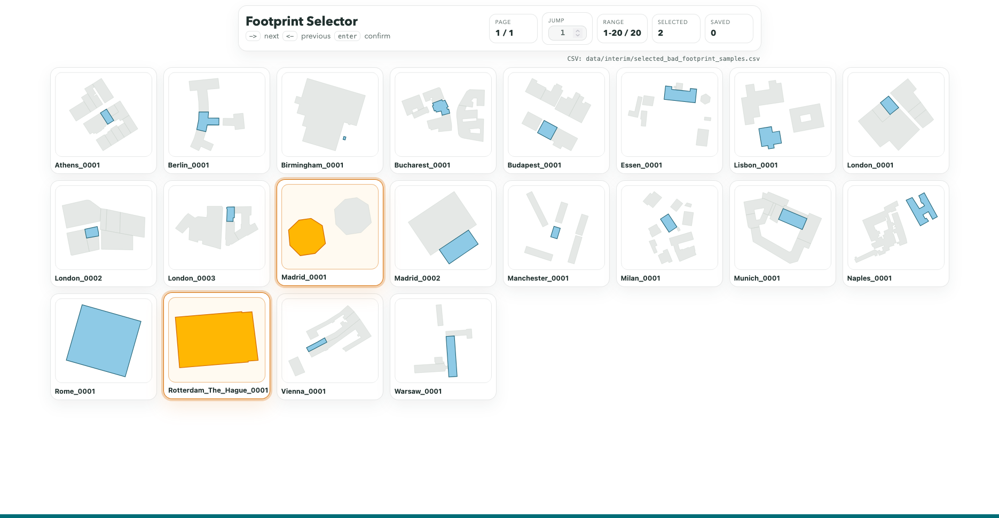
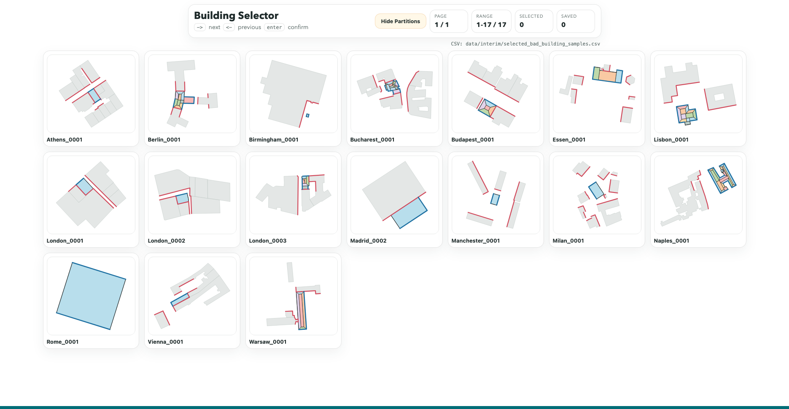
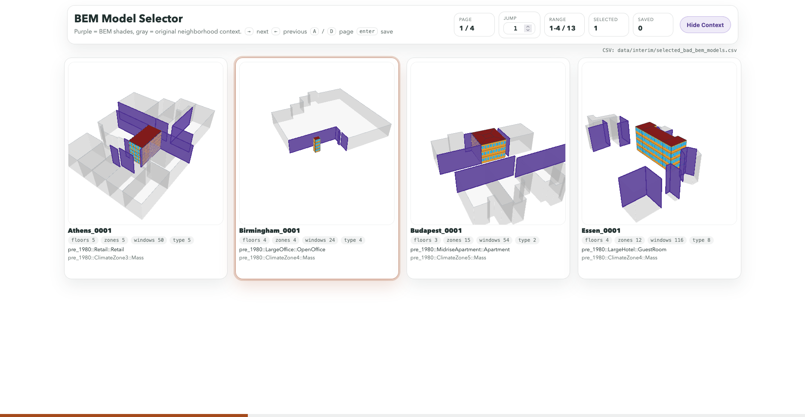

# Manual review frontends

This directory contains the browser frontends for three manual quality-control
steps in the BEM4AI notebook workflow:

- `footprint_selector/` is launched by the final section of
  `notebooks/BEM4AI_3_Buildings.ipynb`. It reviews sampled OSM footprints and
  their surrounding buildings before geometry transformation.
- `building_selector/` is launched by the final section of
  `notebooks/BEM4AI_4_ModelTransformations.ipynb`. It reviews transformed
  building geometry, zones, windows, shades, and neighboring context before BEM
  generation.
- `bem_selector/` is launched by the final section of
  `notebooks/BEM4AI_5_BEMModels.ipynb`. It reads the validated model index and
  HBJSON files, then adds the Stage 4 neighborhood geometry as a review overlay.

The HTML files are implementation assets, not standalone applications. Each
frontend requests project data from its matching `serve_*_selector.py` server
in this directory, so opening `index.html` directly cannot load a review
dataset. Run the corresponding notebook launch cell and open the link displayed
there. `server_common.py` provides the HTTP, pagination, and
selection-persistence behavior shared by all three servers. `svg_geometry.py`
provides the two-dimensional SVG conversion used by the footprint and
transformed-building reviews.

The launch cells return immediately while their local servers continue in the
background. Save rejected `sample_id` values in the browser, then run the
following notebook cell to apply the exclusions. An exclusion cell can be run
again after further review. If the review list is empty or has already been
applied, it leaves the artifacts unchanged.

Paths shown in the browser interfaces are relative to the repository root. The
servers continue to resolve and use absolute paths internally.

The application functions mirror the three selectors:

| Review app | Selection file | Application function |
| --- | --- | --- |
| Footprint selector | `selected_bad_footprint_samples.csv` | `apply_footprint_review_selections` |
| Building selector | `selected_bad_building_samples.csv` | `apply_building_review_selections` |
| BEM selector | `selected_bad_bem_models.csv` | `apply_bem_review_selections` |

These functions are defined in `notebooks/helpers/review_selections.py`. They
update related artifacts together, preserve removed records for auditing, and
can be called repeatedly without applying the same exclusion twice. The BEM
review summary counts unique models rather than counting the same model once
for every updated index table.

## Interface preview

### Footprint selector

### Building selector

### BEM selector

All three review interfaces were coded entirely by ChatGPT. The exact ChatGPT
model version used for their original implementation was not recorded.
